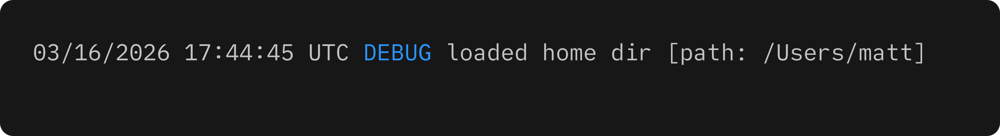
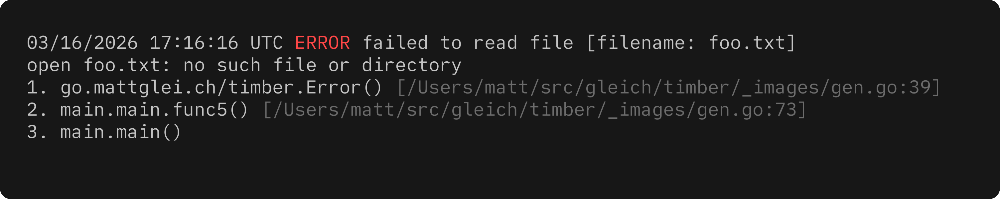
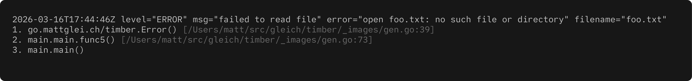
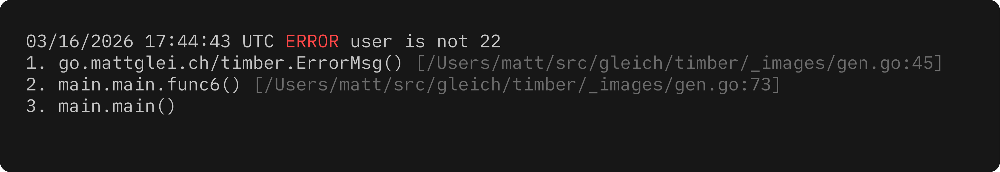
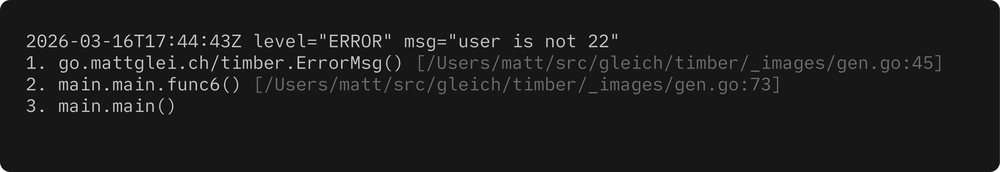
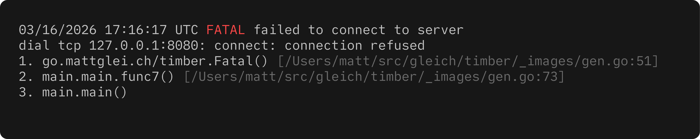
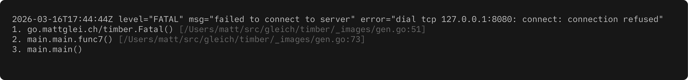
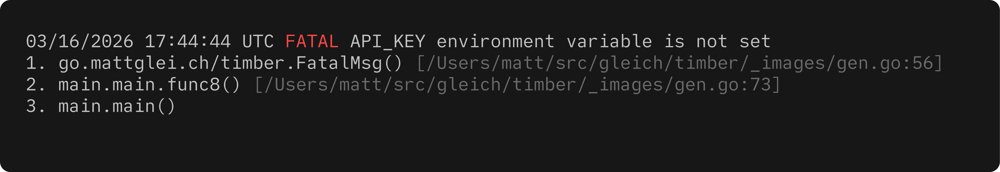
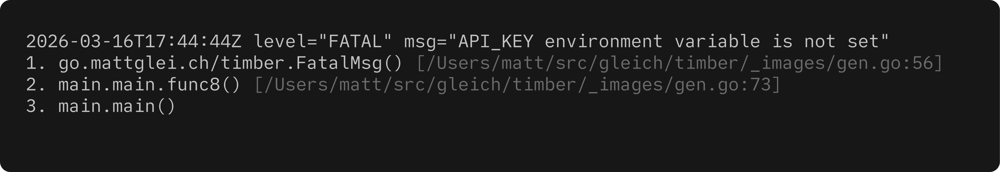

<div align="center">
    <h1>timber</h1>
    <a href="https://pkg.go.dev/go.mattglei.ch/timber"></a>
    
    
    
    <br>
    <i>Plain or structured logs for golang</i>
    <br>
    <br>
</div>

_The original package is [gleich/lumber](https://github.com/gleich/lumber)._

- [Install](#-install)
- [Logging Functions](#-logging-functions)
  - [`timber.Done()`](#timberDone)
  - [`timber.Info()`](#timberinfo)
  - [`timber.Debug()`](#timberdebug)
  - [`timber.Warning()`](#timberwarning)
  - [`timber.Error()`](#timbererror)
  - [`timber.ErrorMsg()`](#timbererrormsg)
  - [`timber.Fatal()`](#timberfatal)
  - [`timber.FatalMsg()`](#timberfatalmsg)
- [Customization](#️-customization)
- [Examples](#-examples)

## Install

Simply run the following from your project root:

```bash
go get -u go.mattglei.ch/timber
```

## Structured Logging

By default, timber outputs human-readable plain logs. To enable structured (key=value) output:

```go
timber.Structured(true)
```

You can attach additional context to any log call using `timber.Attr`:

```go
timber.Info("user signed in",
	timber.Attr{Key: "user_id", Value: 42},
	timber.Attr{Key: "method", Value: "oauth"}
)
```

For brevity, use the `timber.A` shorthand:

```go
timber.Info("user signed in",
	timber.A("user_id", 42),
	timber.A("method", "oauth")
)
```

## Logging Functions

To see a complete reference for the logging functions view the [package documentation](https://pkg.go.dev/go.mattglei.ch).

### [`timber.Done()`](https://pkg.go.dev/go.mattglei.ch/timber#Done)

Output a "DONE" log.

Demo:

```go
sum := 2 + 2
timber.Done("computed the sum of 2 and 2", timber.A("sum", sum))
```

Outputs:


If [structured logging](#structured-logging) is enabled then it would output this instead:


### [`timber.Info()`](https://pkg.go.dev/go.mattglei.ch/timber#Info)

Output a info log.

Demo:

```go
timber.Info("server listening", timber.A("port", 8080))
```

Outputs:


If [structured logging](#structured-logging) is enabled then it would output this instead:


### [`timber.Debug()`](https://pkg.go.dev/go.mattglei.ch/timber#Debug)

Output a debug log.

Demo:

```go
home, _ := os.UserHomeDir()
timber.Debug("loaded home dir", timber.A("path", home))
```

Outputs:



If [structured logging](#structured-logging) is enabled then it would output this instead:


### [`timber.Warning()`](https://pkg.go.dev/go.mattglei.ch/timber#Warning)

Output a warning log.

Demo:

```go
year := time.Now().Year()
if year != 2004 {
  timber.Warning("it is not 2004")
}
```

Outputs:


If [structured logging](#structured-logging) is enabled then it would output this instead:


### [`timber.Error()`](https://pkg.go.dev/go.mattglei.ch/timber#Error)

Output an error log with a stack trace.

Demo:

```go
filename := "foo.txt"
_, err := os.ReadFile(filename)
if err != nil {
    timber.Error(err, "failed to read file", timber.A("filename", filename))
}
```

Outputs:



If [structured logging](#structured-logging) is enabled then it would output this instead:



### [`timber.ErrorMsg()`](https://pkg.go.dev/go.mattglei.ch/timber#ErrorMsg)

Output an error message with a stack trace.

Demo:

```go
age := 21
if age != 22 {
    timber.ErrorMsg("user is not 22")
}
```

Outputs:



If [structured logging](#structured-logging) is enabled then it would output this instead:



### [`timber.Fatal()`](https://pkg.go.dev/go.mattglei.ch/timber#Fatal)

Output a fatal log with a stack trace.

Demo:

```go
_, err := net.Dial("tcp", "localhost:8080")
if err != nil {
    timber.Fatal(err, "failed to connect to server")
}
```

Outputs:



If [structured logging](#structured-logging) is enabled then it would output this instead:



### [`timber.FatalMsg()`](https://pkg.go.dev/go.mattglei.ch/timber#FatalMsg)

Output a fatal message with a stack trace.

Demo:

```go
if os.Getenv("API_KEY") == "" {
    timber.FatalMsg("API_KEY environment variable is not set")
}
```

Outputs:



If [structured logging](#structured-logging) is enabled then it would output this instead:



## Customization

You can customize a number of different features of timber. Below is an example of some of this customization:

```go
timber.Timezone(time.Local)
timber.TimeFormat("Mon Jan 2 15:04:05 MST 2006")
timber.FatalExitCode(0)

timber.Done("calling from custom logger")
```

Check the [godoc documentation](https://pkg.go.dev/go.mattglei.ch/timber) to see all the customization functions.

# Examples

See some examples in the [\_examples/](_examples/) folder.
