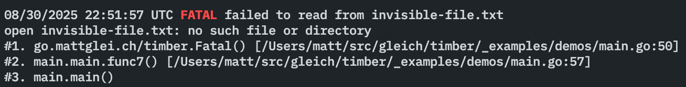
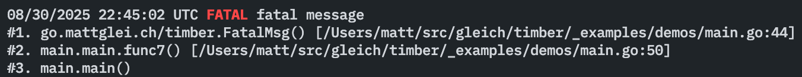

<div align="center">
    <h1>timber</h1>
    <a href="https://pkg.go.dev/pkg.mattglei.ch/timber"></a>
    
    
    
    <br/>
    <br/>
    <i>Easy to use & pretty logger for golang</i>
</div>
<hr>

- [Install](#-install)
- [Logging Functions](#-logging-functions)
  - [`timber.Done()`](#timberDone)
  - [`timber.Info()`](#timberinfo)
  - [`timber.Debug()`](#timberdebug)
  - [`timber.Warning()`](#timberwarning)
  - [`timber.Error()`](#timbererror)
  - [`timber.ErrorMsg()`](#timbererrormsg)
  - [`timber.Fatal()`](#timberfatal)
  - [`timber.FatalMsg()`](#timberfatalmsg)
- [Customization](#️-customization)
- [Examples](#-examples)

## Install

Simply run the following from your project root:

```bash
go get -u pkg.mattglei.ch/timber
```

## Logging Functions

### [`timber.Done()`](https://pkg.go.dev/pkg.mattglei.ch/timber#Done)

Output a "DONE" log.

Demo:

```go
package main

import (
    "time"

    "pkg.mattglei.ch/timber"
)

func main() {
    timber.Done("booted up the program!")
    time.Sleep(2 * time.Second)
    timber.Done("waited 2 seconds!")
}
```

Outputs:


### [`timber.Info()`](https://pkg.go.dev/pkg.mattglei.ch/timber#Info)

Output an info log.

Demo:

```go
package main

import (
    "time"

    "pkg.mattglei.ch/timber"
)

func main() {
    timber.Info("Getting the current year")
    now := time.Now()
    timber.Info("Current year is", now.Year())
}
```

Outputs:


### [`timber.Debug()`](https://pkg.go.dev/pkg.mattglei.ch/timber#Debug)

Output a debug log.

Demo:

```go
package main

import (
    "os"

    "pkg.mattglei.ch/timber"
)

func main() {
    homeDir, _ := os.UserHomeDir()
    timber.Debug("User's home dir is", homeDir)
}
```

Outputs:


### [`timber.Warning()`](https://pkg.go.dev/pkg.mattglei.ch/timber#Warning)

Output a warning log.

Demo:

```go
package main

import (
    "time"

    "pkg.mattglei.ch/timber"
)

func main() {
    now := time.Now()
    if now.Year() != 2004 {
        timber.Warning("Current year isn't 2004")
    }
}
```

Outputs:


### [`timber.Error()`](https://pkg.go.dev/pkg.mattglei.ch/timber#Error)

Output an error log with a stack trace.

Demo:

```go
package main

import (
    "os"

    "pkg.mattglei.ch/timber"
)

func main() {
    fname := "invisible-file.txt"
    _, err := os.ReadFile(fName)
    if err != nil {
        timber.Error(err, "Failed to read from", fname)
    }
}
```

Outputs:


### [`timber.ErrorMsg()`](https://pkg.go.dev/pkg.mattglei.ch/timber#ErrorMsg)

Output an error message.

Demo:

```go
package main

import "pkg.mattglei.ch/timber"

func main() {
    timber.ErrorMsg("Ahhh stuff broke")
}
```

Outputs:


### [`timber.Fatal()`](https://pkg.go.dev/pkg.mattglei.ch/timber#Fatal)

Output a fatal log with a stack trace.

Demo:

```go
package main

import (
    "os"

    "pkg.mattglei.ch/timber"
)

func main() {
    fName := "invisible-file.txt"
    _, err := os.ReadFile(fName)
    if err != nil {
        timber.Fatal(err, "Failed to read from", fName)
    }
}
```

Outputs:



### [`timber.FatalMsg()`](https://pkg.go.dev/pkg.mattglei.ch/timber#FatalMsg)

Output a fatal message.

Demo:

```go
package main

import "pkg.mattglei.ch/timber"

func main() {
    timber.FatalMsg("Ahhh stuff broke")
}
```

Outputs:



## Customization

You can customize the logger that timber uses. Below is an example of some of this customization:

```go
package main

import (
    "time"

    "pkg.mattglei.ch/timber"
)

func main() {
    timber.SetTimezone(time.Local)
    timber.SetTimeFormat("Mon Jan 2 15:04:05 MST 2006")
    timber.SetFatalExitCode(0)

    timber.Done("Calling from custom logger")
}
```

# Examples

See some examples in the [\_examples/](_examples/) folder.
